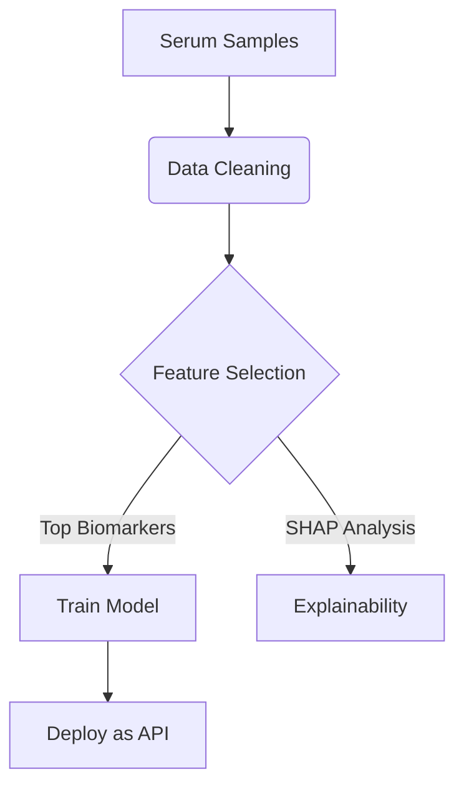

# NeuroMarkerAI 
### AI-Powered Early Detection of Brain Tumors from Serum Biomarkers  

A machine learning pipeline for non-invasive brain tumor risk prediction using circulating biomarkers (IL-6, VEGF, GFAP, etc.). Includes:  
- Automated data preprocessing  
- Explainable AI (SHAP/LIME)  
- Flask/FastAPI deployment  
- Clinical validation notebooks

